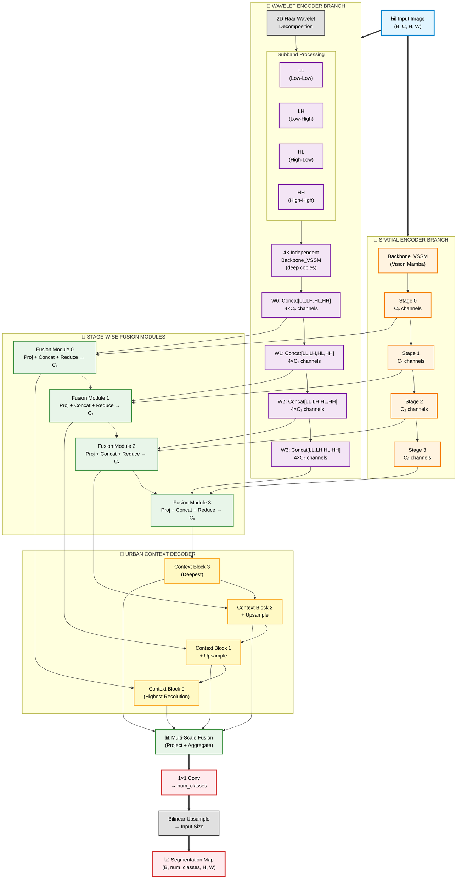

# UrbanMamba Architecture Diagram

Below is a Mermaid diagram representing the dual-branch UrbanMamba segmentation model as implemented in `semanticsegmentation/models/UrbanMamba.py`.

## Architecture Overview

### Key Components

1. **Dual Encoder Branches**
   - **Spatial Encoder**: Standard Vision Mamba (VSSM) backbone extracting spatial features at 4 scales
   - **Wavelet Encoder**: Haar decomposition + 4 independent VSSM encoders (one per subband) capturing frequency information

2. **Stage-wise Fusion Modules**
   - Fuse spatial (C) and wavelet (4×C) features at each scale
   - Operations: Project → Concatenate → Reduce → Mix → Output Cₓ channels

3. **Urban Context Decoder**
   - Hierarchical decoder with attention-based context blocks
   - Progressively upsamples and refines features from deep to shallow
   - Combines spatial + channel attention mechanisms

4. **Multi-Scale Fusion + Classifier**
   - Aggregates decoder outputs across all scales
   - 1×1 convolution produces per-pixel class logits
   - Bilinear upsampling to match input resolution

### Preview Instructions

- Open this file in VS Code and use the built-in Markdown preview
- For Mermaid rendering, install the **"Markdown Preview Mermaid Support"** extension
- Alternatively, view on GitHub or any Mermaid-compatible viewer
